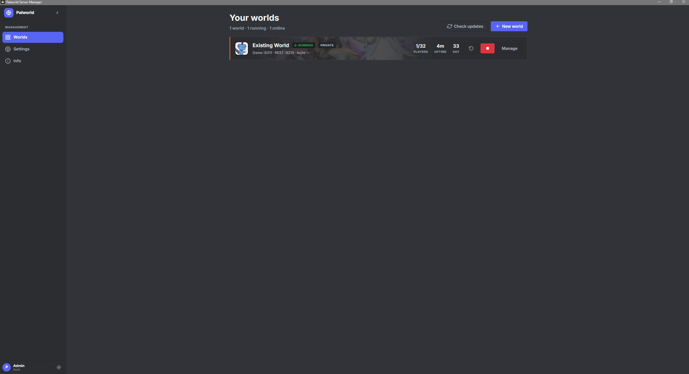

# Palworld Server Manager

A desktop app for Windows and Linux that makes running one or more **Palworld dedicated
servers** simple — no command line, no editing config files by hand. Install it, point it at
a server (new or existing), and manage everything from a clean interface.

---

## Screenshots

| Your worlds | World overview |
| --- | --- |
|  |  |

| Settings editor | Admin |
| --- | --- |
|  |  |

| Mods | |
| --- | --- |
|  | |

---

## What it does

- **Provision new servers** via SteamCMD, or **adopt an existing** Palworld dedicated
  server install (it keeps your world, settings, and admin password).
- **Cross-platform hosting** — provision a **Windows** or **Linux** server regardless of
  the host OS, and run a Windows-target server on a Linux machine through **Wine** (per-world
  Wine binary, prefix, and launch flags). This is how you run Windows-only mods while
  self-hosting on Linux. (Requires Wine on the Linux host; a Linux-target world can't run
  on Windows.)
- **Start / stop / restart / update** each world with one click. A crash guardian can
  automatically restart a server that goes down, and an optional **auto-update** keeps a
  world on the latest Palworld build — warning players in-game before it restarts to apply.
- **Full settings editor** — every option from `PalWorldSettings.ini` (100+ settings)
  grouped into readable sections, with search, per-field reset, and community-tested
  presets. Only the settings you change are written, so nothing else is disturbed.
- **Players** — see who's online; kick / ban / unban through the official REST API.
- **Live Map** — plot online players on the world map in real time.
- **Console** — live server log stream.
- **Backups** — take, restore, and schedule world backups.
- **Schedule** — automatic restarts / backups on an interval or at a set time.
- **Mods** — import and toggle Steam Workshop mods, install **UE4SS**, and install
  **PalSchema** plus its JSON content mods (the kind published on Nexus) — one-click
  framework install, import, enable/disable, and remove, all from the Mods tab.
- **Chat & Broadcast** — read in-game chat live and send announcements to players.
- **Discord notifications** — post server events (start, stop, restart, crash, backup,
  update) to Discord and relay in-game chat. Add several webhook **channels** per world
  and route each event to whichever channel you want.
- **Discord bot** — run a world from your own bot with slash commands: `/start`,
  `/stop`, `/restart`, `/broadcast`, `/backup`, `/status`, `/kick`, and
  `/player-location` (posts the live map with each online player's dot and name). You
  choose who may use each command; the bot only ever answers its own commands.
- **Languages** — use the app in English, Spanish, Japanese, or Chinese, switched from
  Settings and applied instantly. Install more community translation packs from GitHub
  in one click, or bring your own — no restart needed.
- **Customize** each world with a profile icon, banner, and accent color.
- **Export / Import** settings and full world profiles as zip files, for sharing or
  moving between machines.
- **Multiple worlds** side by side, each with its own ports (auto-assigned to avoid
  collisions).
- **Safe deletes** — removing a server's files, a mod, or a save moves them to the
  Recycle Bin (Windows) or Trash (Linux), so a mistake stays recoverable.

---

## Download

Grab the latest installer from the
[**Releases**](https://github.com/PrakashMandal-IV/palworld-server-manager/releases/latest) page:

- **Windows (installer):** `Palworld Server Manager Setup <version>.exe`
- **Windows (portable, no install):** `PalworldServerManager-<version>-portable.exe` — runs
  without installing and keeps all its data in a `PSM-Data` folder next to the `.exe`, so
  you can carry it (and your worlds) on a USB stick or between PCs.
- **Linux:** `Palworld Server Manager-<version>.AppImage`

> The Windows builds are not yet code-signed, so SmartScreen may show an
> "unrecognized app" warning. Click **More info → Run anyway** to proceed.

---

## Getting started

1. **Install** the app using the provided installer (Windows) or AppImage (Linux).
2. On first launch you'll see **Your worlds**. Click **New world** to create one, or use
   **Use existing** to adopt a server you already have (for example under
   `Steam\steamapps\common\PalServer`).
3. Once a world is listed, click **Start**. The first launch may take a moment while the
   server initializes.
4. Open a world and use the tabs — Overview, Players, Broadcast, Chat, Console, Settings,
   Backups, Schedule, Mods, Discord, Admin — to manage it.

---

## Connecting to your server

Open a world and look at the **Connect** box on the Overview tab. On the same PC, players
join with:

```
127.0.0.1:<game port>     (e.g. 127.0.0.1:8211)
```

In Palworld: **Join Multiplayer → Connect via IP** and paste the address.

### Letting friends join over the internet
By default your server is only reachable on your local network. To open it up you can port
forward on your router, or use a free tunneling service. The app includes a step-by-step
guide for **playit.gg** (a free option that needs no router changes) under the **Info**
section. This is a recommendation, not a requirement.

---

## Dedicated vs community servers

A **community server** is the same as a dedicated server, except it also appears in
Palworld's in-game public server browser so anyone can find and join it. It's toggled with
a launch flag. A **private/dedicated** server is joined by IP only. Either way, the app manages it the same — toggle it per world in the Admin tab.

---

## A note on settings

Palworld only applies server settings **when the server boots**, so after changing settings
you must **restart** the world for them to take effect. The app writes a minimal config
(only what you change), matching how Palworld itself stores settings — so your existing
values and any in-game choices are preserved.

Ports, the REST API, and the admin password are managed by the app automatically and aren't
shown in the settings editor, so they can't be broken by accident.

---

## Data & storage

The app stores its registry (your list of worlds and their metadata) in your user data
folder:

- **Windows (installer):** `%APPDATA%\palworld-server-manager\`
- **Windows (portable):** a `PSM-Data` folder next to the portable `.exe`
- **Linux:** `~/.config/palworld-server-manager/`

Your actual Palworld worlds, saves, and settings stay in each server's own install folder —
the app never moves them.

---

## Requirements

- Windows 10/11 (64-bit) or a modern 64-bit Linux distribution.
- Enough disk space for the Palworld dedicated server and its saves.
- For provisioning new servers: an internet connection (SteamCMD downloads the server).

---

## Building from source

Requires Node.js 22.5+.

```bash
npm install
npm run dist:win      # Windows installer + portable .exe -> release/
npm run dist:linux    # Linux AppImage                    -> release/
npm run pack          # unpacked build for testing        -> release/
```

On Windows, run the first packaging build from a terminal opened **as Administrator** (or
with Developer Mode enabled) so electron-builder can extract its tooling.

---

## Tech

Electron shell wrapping a self-contained Next.js server (App Router). Data is stored in
SQLite via a pure-WASM backend, so the app needs no native modules or database install.
All Palworld administration uses the official REST API; the deprecated RCON protocol is off
by default and opt-in only.
